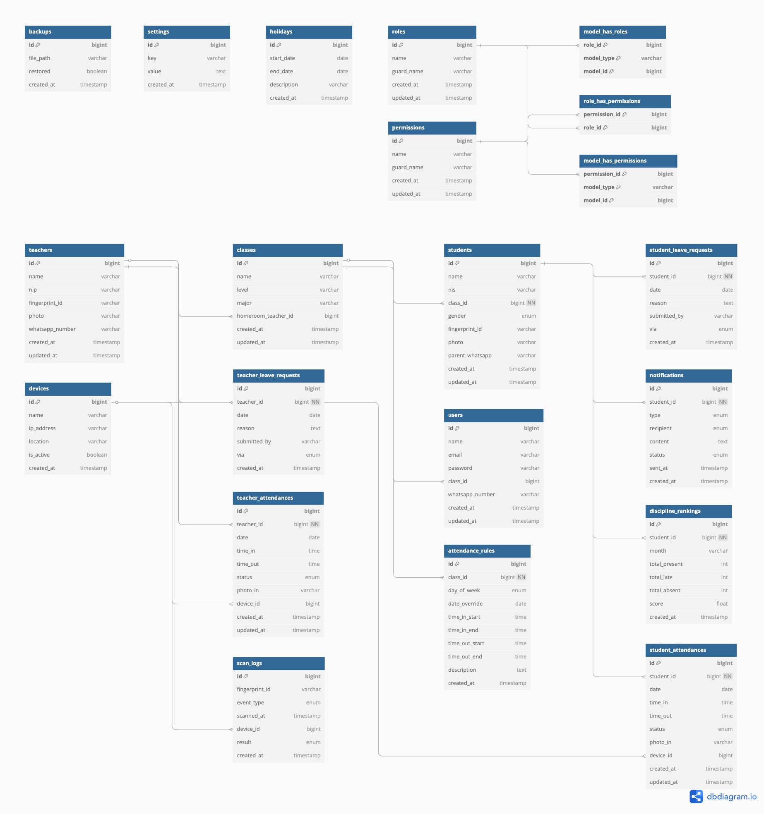

# 🗃️ Desain Database

## 📂 Daftar Halaman Dokumentasi
- [01 - Pendahuluan](01-pendahuluan.md)
- [02 - Fitur Aplikasi](02-fitur-aplikasi.md)
- [03 - Desain Database](03-desain-database.md)
- [04 - Alur Aplikasi](04-alur-aplikasi.md)
- [05 - Teknologi](05-teknologi.md)
- [06 - Pengembangan](06-pengembangan.md)
- [07 - Pengujian](07-pengujian.md)
- [08 - Deploy dan Maintenance](08-deploy.md)
- [09 - Wireframe](09-wireframe/README.md)

## 📚 Daftar Isi Halaman
- [1. Ringkasan Tabel Utama](#1.-ringkasan-tabel-utama)
- [2. Struktur dan Relasi Detail](#2.-struktur-dan-relasi-detail)
- [3. Penjelasan Relasi Antar Tabel](#3.-penjelasan-relasi-antar-tabel)

## 1. Ringkasan Tabel Utama

| Tabel                                | Deskripsi Ringkas                                                                 |
|--------------------------------------|------------------------------------------------------------------------------------|
| [`students`](#tabel%3A-students)        | Menyimpan data lengkap siswa, termasuk kelas dan jurusan terpisah                 |
| [`teachers`](#tabel%3A-teachers)        | Menyimpan data guru yang menggunakan fingerprint                                  |
| [`student_attendances`](#tabel%3A-student_attendances)  | Mencatat kehadiran harian siswa secara terpisah, termasuk waktu masuk/keluar, status     |
| [`teacher_attendances`](#tabel%3A-teacher_attendances)  | Mencatat kehadiran harian guru secara terpisah, termasuk waktu masuk/keluar, status     |
| [`student_leave_requests`](#tabel%3A-student_leave_requests) | Menyimpan pengajuan izin siswa dari Google Form                        |
| [`teacher_leave_requests`](#-tabel%3A-teacher_leave_requests) | Menyimpan data izin guru, baik dari Google Form maupun input manual admin.
| [`holidays`](#tabel%3A-holidays) | Menyimpan data hari libur untuk mengatasi kesalahan perhitungan data ketika hari libur
| [`notifications`](#tabel%3A-notifications) | Menyimpan log pengiriman pesan WA ke orang tua, wali kelas, dan kesiswaan      |
| [`discipline_rankings`](#tabel%3A-discipline_rankings) | Peringkat disiplin bulanan siswa                                  |
| [`users`](#tabel%3A-users)              | Akun login untuk admin, guru, dan petugas lainnya                                 |
| [`roles`](#tabel%3A-roles), [`permissions`](#tabel%3A-permissions) | Sistem hak akses (Spatie Role & Permission)            |
| [`model_has_roles`](#tabel%3A-model_has_roles), [`model_has_permissions`](#tabel%3A-model_has_permissions) | Relasi user dengan role/permission langsung |
| [`role_has_permissions`](#tabel%3A-role_has_permissions) | Relasi antara role dan permission                                   |
| [`backups`](#tabel%3A-backups)          | Data backup mingguan dan restore sistem                                           |
| [`settings`](#tabel%3A-settings)        | Semua konfigurasi sistem (termasuk jam absen & WA API)                           |
| [`devices`](#tabel%3A-devices)          | Info perangkat fingerprint (IP, status, lokasi)                                  |
| [`attendance_rules`](#tabel%3A-attendance_rules) | Rentang jam masuk dan pulang untuk absensi                           |
| [`scan_logs`](#tabel%3A-scan_logs) | Audit log aktivitas scan sidik jari siswa                            |
| [`classes`](#tabel%3A-classes) | Kelas siswa                            |

## 2. Struktur dan Relasi Detail

Bagian ini menjelaskan secara lengkap struktur basis data aplikasi Absensi STM.  
Setiap tabel yang digunakan dijabarkan dalam bentuk:

- 📌 Nama kolom dan tipe datanya
- 💬 Deskripsi singkat fungsi kolom
- 🔖 Sifat khusus seperti: Primary Key (PK), Foreign Key (FK), Unique, Enum, dll

Struktur ini disusun agar bisa:
- 💻 Diterapkan langsung dalam perancangan database (MySQL/PostgreSQL)
- 🧠 Dipahami baik oleh pengembang maupun pembaca non-teknis
- 🔁 Mendukung fitur otomatisasi, keamanan data, dan fleksibilitas sistem absensi

---

### Tabel: `students`

Tabel ini menyimpan seluruh data siswa yang akan dicatat kehadirannya menggunakan fingerprint scanner.  
Digunakan sebagai acuan utama untuk:

- Absensi
- Perizinan
- Notifikasi ke orang tua
- Peringkat kedisiplinan

**Fungsi-fungsi penting:**
- Menghubungkan data siswa ke semua tabel absensi dan izin
- Menyimpan ID fingerprint untuk identifikasi biometrik
- Nomor WA digunakan untuk pengiriman notifikasi otomatis

| Kolom             | Tipe Data   | Keterangan                              | Sifat Khusus        |
|-------------------|-------------|------------------------------------------|----------------------|
| `id`              | BIGINT      | ID unik siswa                            | PK                   |
| `name`            | VARCHAR     | Nama lengkap siswa                       |                      |
| `nis`             | VARCHAR     | Nomor Induk Siswa                        | UNIQUE               |
| `class_id`        | BIGINT      | ID kelas siswa (FK → `classes.id`)       |                      |
| `gender`          | ENUM        | Jenis kelamin siswa                      | ENUM (`L`, `P`)      |
| `fingerprint_id`  | VARCHAR     | ID fingerprint (dari mesin absensi)      | Indexed              |
| `photo`           | VARCHAR     | Path/URL ke file foto siswa              |                      |
| `parent_whatsapp` | VARCHAR     | Nomor WhatsApp orang tua                 |                      |
| `created_at`      | TIMESTAMP   | Waktu data dibuat                        |                      |
| `updated_at`      | TIMESTAMP   | Waktu data terakhir diperbarui           |                      |

---
### Tabel: `teachers`

Tabel ini menyimpan data guru yang juga menggunakan fingerprint.  
Biasanya digunakan jika guru juga diminta melakukan absensi secara digital.

**Fungsi-fungsi penting:**
- Mendukung kehadiran guru di tabel `attendances`
- Bisa dikembangkan untuk melihat kehadiran per guru
- Memberikan fleksibilitas agar sistem bisa digunakan lintas peran

| Kolom            | Tipe Data   | Keterangan                                     | Sifat Khusus |
|------------------|-------------|------------------------------------------------|--------------|
| `id`             | BIGINT      | ID unik guru                                   | PK           |
| `name`           | VARCHAR     | Nama lengkap guru                              |              |
| `nip`            | VARCHAR     | Nomor Induk Pegawai (jika ada)                |              |
| `fingerprint_id` | VARCHAR     | ID fingerprint (jika guru menggunakan absen)   | Indexed      |
| `photo`          | VARCHAR     | Path/URL ke foto guru                          |              |
| `whatsapp_number`  | varchar   | Nomor WhatsApp (termasuk wali kelas)           |              |
| `created_at`     | TIMESTAMP   | Tanggal data dibuat                            |              |
| `updated_at`     | TIMESTAMP   | Tanggal data diperbarui terakhir               |              |
---

### Tabel: `student_attendances`

Tabel ini menyimpan catatan absensi khusus untuk siswa.

| Kolom            | Tipe Data | Keterangan                                                 | Sifat Khusus     |
|------------------|-----------|-------------------------------------------------------------|------------------|
| `id`             | BIGINT    | ID unik absensi                                            | PK               |
| `student_id`     | BIGINT    | ID siswa yang absen                                        | FK → `students.id` |
| `date`           | DATE      | Tanggal absensi                                            | Required         |
| `time_in`        | TIME      | Waktu scan masuk                                           | Optional         |
| `time_out`       | TIME      | Waktu scan keluar                                          | Optional         |
| `status`         | ENUM      | `hadir`, `terlambat`, `tidak_hadir`, `izin`               | Otomatis         |
| `photo_in`       | VARCHAR   | Foto hasil verifikasi absensi                              | Optional         |
| `device_id`  | BIGINT    | ID perangkat yang digunakan untuk scan         | FK → `devices.id`             |
| `created_at`     | TIMESTAMP | Waktu data dicatat                                         | Otomatis         |
| `updated_at`     | TIMESTAMP | Waktu terakhir data diubah                                 | Otomatis         |

---

### Tabel: `teacher_attendances`

Tabel ini menyimpan catatan absensi khusus untuk guru/pengajar.

| Kolom            | Tipe Data | Keterangan                                                 | Sifat Khusus     |
|------------------|-----------|-------------------------------------------------------------|------------------|
| `id`             | BIGINT    | ID unik absensi                                            | PK               |
| `teacher_id`     | BIGINT    | ID guru yang absen                                         | FK → `teachers.id` |
| `date`           | DATE      | Tanggal absensi                                            | Required         |
| `time_in`        | TIME      | Waktu scan masuk                                           | Optional         |
| `time_out`       | TIME      | Waktu scan keluar                                          | Optional         |
| `status`         | ENUM      | `hadir`, `terlambat`, `tidak_hadir`, `izin`               | Otomatis         |
| `photo_in`       | VARCHAR   | Foto hasil verifikasi absensi                              | Optional         |
| `device_id`  | BIGINT    | ID perangkat yang digunakan untuk scan         | FK → `devices.id`             |
| `created_at`     | TIMESTAMP | Waktu data dicatat                                         | Otomatis         |
| `updated_at`     | TIMESTAMP | Waktu terakhir data diubah                                 | Otomatis         |

#### Catatan Desain:

- Tabel absensi dipisahkan berdasarkan jenis pengguna demi menjaga validitas relasi (`FK`)
- Memudahkan filter dan laporan per jenis user
- Jika ingin rekap gabungan, gunakan `UNION` SQL atau `merge()` Laravel Collection

---
### Tabel: `student_leave_requests`
Tabel ini menyimpan data izin siswa yang diajukan melalui Google Form, WhatsApp, atau cara lain.

**Fungsi-fungsi penting:**
- Mendokumentasikan semua pengajuan izin
- Membantu sistem mengabaikan keterlambatan/ketidakhadiran jika izin valid
- Dihubungkan ke Google Sheets menggunakan API untuk pengambilan otomatis
- Digunakan oleh admin untuk verifikasi dan rekap alasan izin

| Kolom         | Tipe Data | Keterangan                                                            | Sifat Khusus       |
|---------------|-----------|------------------------------------------------------------------------|--------------------|
| `id`          | BIGINT    | ID unik permintaan izin                                                | PK                 |
| `student_id`  | BIGINT    | ID siswa yang mengajukan izin                                          | FK → `students.id` |
| `date`        | DATE      | Tanggal yang diajukan untuk izin                                       |                    |
| `reason`      | TEXT      | Alasan izin yang diisi dalam form                                     |                    |
| `submitted_by`| VARCHAR   | Nama pengisi form (bisa siswa atau orang tua)                         |                    |
| `via`         | ENUM      | Media pengajuan: `form_online` atau lainnya jika ditambahkan          | ENUM               |
| `created_at`  | TIMESTAMP | Waktu pengajuan izin masuk ke sistem                                  |                    |
| `updated_at`  | TIMESTAMP | Waktu terakhir data diubah                                 | Otomatis         |
---

### Tabel: `teacher_leave_requests`

Tabel ini menyimpan data izin kehadiran guru yang dapat diajukan melalui form internal atau dimasukkan langsung oleh admin/operator.

| Kolom          | Tipe Data | Keterangan                                                       | Sifat Khusus                  |
|----------------|-----------|-------------------------------------------------------------------|-------------------------------|
| `id`           | BIGINT    | ID unik izin guru                                                | PK                            |
| `teacher_id`   | BIGINT    | ID guru yang mengajukan izin                                     | FK → `teachers.id`            |
| `date`         | DATE      | Tanggal izin                                                     | Required                      |
| `reason`       | TEXT      | Alasan izin                                                      | Optional                      |
| `submitted_by` | VARCHAR   | Nama pengaju atau pencatat izin                                  | Optional                      |
| `via`          | ENUM      | `manual` atau `internal_form`                                    | Menandai metode pengajuan     |
| `created_at`   | TIMESTAMP | Waktu izin dicatat                                               | Otomatis                      |
| `updated_at`   | TIMESTAMP | Waktu terakhir data diubah                                 | Otomatis         |

---

### Tabel: `holidays`

Tabel ini menyimpan data hari libur, baik satu hari maupun rentang libur panjang, seperti libur Idul Fitri, akhir semester, atau libur darurat.

| Kolom         | Tipe Data | Keterangan                                                               | Sifat Khusus     |
|---------------|-----------|---------------------------------------------------------------------------|------------------|
| `id`          | BIGINT    | ID unik libur                                                            | PK               |
| `start_date`  | DATE      | Tanggal awal libur                                                       | Required         |
| `end_date`    | DATE      | Tanggal akhir libur (boleh sama dengan `start_date` untuk libur 1 hari)  | Required         |
| `description` | VARCHAR   | Keterangan libur, contoh: Libur Akhir Semester                           | Required         |
| `created_at`  | TIMESTAMP | Waktu pencatatan                                                         | Otomatis         |
| `updated_at`  | TIMESTAMP | Waktu terakhir data diubah                                 | Otomatis         |

---

### Tabel: `notifications`
Tabel ini menyimpan semua log pengiriman pesan WhatsApp yang dilakukan sistem.

**Fungsi-fungsi penting:**
- Merekam semua pesan WA: keterlambatan, tidak hadir, izin, dan rekap PDF
- Menunjukkan siapa penerima pesan: orang tua, wali kelas, atau kesiswaan
- Menyimpan status kirim (`sent`, `failed`) dan waktu pengiriman (`sent_at`)
- Membantu debugging jika pesan tidak sampai

| Kolom         | Tipe Data | Keterangan                                                            | Sifat Khusus       |
|---------------|-----------|------------------------------------------------------------------------|--------------------|
| `id`          | BIGINT    | ID unik notifikasi                                                     | PK                 |
| `student_id`  | BIGINT    | ID siswa yang menjadi subjek notifikasi                                | FK → `students.id` |
| `type`        | ENUM      | Jenis notifikasi: `izin`, `tidak_hadir`, `keterlambatan`, `rekap`      | ENUM               |
| `recipient`   | ENUM      | Penerima pesan: `orang_tua`, `wali_kelas`, `kesiswaan`                 | ENUM               |
| `content`     | TEXT      | Isi pesan yang dikirim melalui WhatsApp atau sistem lainnya            |                    |
| `status`      | ENUM      | Status pengiriman: `sent`, `failed`                                    | ENUM               |
| `sent_at`     | TIMESTAMP | Waktu saat pesan dikirim                                               |                    |
| `created_at`  | TIMESTAMP | Waktu data ini dibuat                                                | Otomatis         |
| `updated_at`  | TIMESTAMP | Waktu terakhir data diubah                                 | Otomatis         |
---
### Tabel: `discipline_rankings`

Tabel ini menyimpan rekap kedisiplinan siswa dalam satu bulan.

**Fungsi-fungsi penting:**
- Menghitung jumlah kehadiran, keterlambatan, dan ketidakhadiran tiap siswa
- Menghasilkan skor kedisiplinan otomatis
- Digunakan untuk dashboard peringkat atau sistem reward/sanksi siswa
- Bisa jadi dasar seleksi siswa berprestasi non-akademik

| Kolom          | Tipe Data | Keterangan                                                           | Sifat Khusus       |
|----------------|-----------|-----------------------------------------------------------------------|--------------------|
| `id`           | BIGINT    | ID unik peringkat disiplin                                           | PK                 |
| `student_id`   | BIGINT    | ID siswa yang direkap                                                | FK → `students.id` |
| `month`        | VARCHAR   | Bulan perhitungan (misal: `2024-06`)                                 | Unique Index       |
| `total_present`| INT       | Jumlah hari hadir                                                    |                    |
| `total_late`   | INT       | Jumlah hari terlambat                                                |                    |
| `total_absent` | INT       | Jumlah hari tidak hadir (tidak izin dan tidak scan)                 |                    |
| `score`        | FLOAT     | Skor akhir disiplin (formula fleksibel, tergantung aturan sekolah)   |                    |
| `created_at`   | TIMESTAMP | Waktu data ini dibuat                                                |                    |
| `updated_at`   | TIMESTAMP | Waktu terakhir data diubah                                 | Otomatis         |
---
### Tabel: `users`

Tabel ini menyimpan akun pengguna sistem (admin, guru, operator, dsb).

**Fungsi-fungsi penting:**
- Menyimpan data login seperti `email`, `password`, dan nomor WhatsApp
- Kolom `class_id` bisa digunakan untuk membatasi akses user ke kelas tertentu (misalnya wali kelas hanya bisa lihat kelasnya)
- Semua user bisa dikaitkan ke `roles` dan `permissions` melalui tabel pivot

| Kolom             | Tipe Data | Keterangan                                          | Sifat Khusus |
|-------------------|-----------|------------------------------------------------------|--------------|
| `id`              | BIGINT    | ID unik pengguna sistem                             | PK           |
| `name`            | VARCHAR   | Nama pengguna                                        |              |
| `email`           | VARCHAR   | Email login (harus unik jika digunakan)             | UNIQUE       |
| `password`        | VARCHAR   | Password terenkripsi                                |              |
| `class_id`        | BIGINT    | ID kelas (FK → `classes.id`)                        | Nullable     |
| `whatsapp_number` | VARCHAR   | Nomor WhatsApp user (misal admin, guru, dsb)        |              |
| `created_at`      | TIMESTAMP | Tanggal dibuat                                       |              |
| `updated_at`      | TIMESTAMP | Tanggal terakhir diperbarui                          |              |

---
### Tabel: `roles`

Tabel ini menyimpan daftar peran atau jabatan yang dapat dimiliki user, seperti `admin`, `wali_kelas`, `kesiswaan`, dll.

**Fungsi-fungsi penting:**
- Peran digunakan untuk mengatur akses halaman & fitur di Filament Panel
- Satu user bisa memiliki lebih dari satu role

| Kolom         | Tipe Data | Keterangan                  | Sifat Khusus |
|---------------|-----------|------------------------------|--------------|
| `id`          | BIGINT    | ID peran                    | PK           |
| `name`        | VARCHAR   | Nama peran (`admin`, `guru`, `wali_kelas`, dll) |  |
| `guard_name`  | VARCHAR   | Nama guard (biasanya `web`) |              |
| `created_at`  | TIMESTAMP |                             |              |
| `updated_at`  | TIMESTAMP |                             |              |

---
### Tabel: `permissions`
Tabel ini menyimpan hak akses detail, misalnya:
- `view_attendance`, `edit_settings`, `send_notification`, dll.

**Fungsi-fungsi penting:**
- Bisa dihubungkan langsung ke user (`model_has_permissions`) atau melalui role (`role_has_permissions`)
- Memungkinkan sistem akses yang fleksibel dan aman

| Kolom         | Tipe Data | Keterangan                   | Sifat Khusus |
|---------------|-----------|-------------------------------|--------------|
| `id`          | BIGINT    | ID hak akses                 | PK           |
| `name`        | VARCHAR   | Nama permission (`lihat_absen`, dll) |          |
| `guard_name`  | VARCHAR   | Guard (biasanya `web`)       |              |
| `created_at`  | TIMESTAMP |                               |              |
| `updated_at`  | TIMESTAMP |                               |              |

---
### Tabel: `model_has_roles`
Tabel pivot yang menghubungkan user ke role-nya.

**Fungsi-fungsi penting:**
- 1 user bisa punya banyak role
- Role bisa digunakan untuk filter data, akses menu, dsb.

| Kolom        | Tipe Data | Keterangan                              | Sifat Khusus        |
|--------------|-----------|------------------------------------------|---------------------|
| `role_id`    | BIGINT    | ID peran                                 | FK → `roles.id`     |
| `model_type` | VARCHAR   | Tipe model (biasanya `App\\Models\\User`)|                     |
| `model_id`   | BIGINT    | ID user                                  | FK → `users.id`     |
| `created_at` | TIMESTAMP | Tanggal assign                           |                     |
| **PK**       | Composite | (`role_id`, `model_type`, `model_id`)    | PK                  |

---
### Tabel: `model_has_permissions`
Tabel pivot yang menghubungkan user ke permission spesifik, tanpa lewat role.

**Fungsi-fungsi penting:**
- Untuk memberi akses unik ke satu user tanpa mengubah role

| Kolom           | Tipe Data | Keterangan                           | Sifat Khusus        |
|-----------------|-----------|---------------------------------------|---------------------|
| `permission_id` | BIGINT    | ID permission                         | FK → `permissions.id` |
| `model_type`    | VARCHAR   | Tipe model (`User`)                   |                     |
| `model_id`      | BIGINT    | ID model                              | FK → `users.id`     |
| `created_at`    | TIMESTAMP |                                       |                     |
| **PK**          | Composite | (`permission_id`, `model_type`, `model_id`) | PK           |

---
### Tabel: `role_has_permissions`
Tabel pivot yang menghubungkan role dengan permission.

**Fungsi-fungsi penting:**
- Semua user yang punya role tertentu otomatis mewarisi permission yang terhubung
- Ini yang membuat sistem hak akses bisa “bertingkat” dan fleksibel

| Kolom           | Tipe Data | Keterangan                          | Sifat Khusus        |
|-----------------|-----------|--------------------------------------|---------------------|
| `permission_id` | BIGINT    | ID permission                        | FK → `permissions.id` |
| `role_id`       | BIGINT    | ID role                              | FK → `roles.id`     |
| `created_at`    | TIMESTAMP |                                      |                     |
| **PK**          | Composite | (`permission_id`, `role_id`)         | PK                  |

---
### Tabel: `backups`
Tabel ini mencatat data backup yang dibuat secara otomatis maupun manual.

**Fungsi-fungsi penting:**
- Menyimpan path file backup `.sql`, `.zip`, atau data absensi mingguan
- Menunjukkan apakah file tersebut sudah pernah digunakan untuk restore
- Meningkatkan keamanan data dan pemulihan bencana (disaster recovery)

| Kolom         | Tipe Data | Keterangan                                  | Sifat Khusus |
|---------------|-----------|----------------------------------------------|--------------|
| `id`          | BIGINT    | ID unik backup                              | PK           |
| `file_path`   | VARCHAR   | Lokasi file backup disimpan (ZIP, SQL, dsb) |              |
| `restored`    | BOOLEAN   | Status apakah backup ini pernah di-restore  |              |
| `created_at`  | TIMESTAMP | Tanggal backup dibuat                       |              |
| `updated_at`  | TIMESTAMP | Waktu terakhir data diubah                                 | Otomatis         |

---
### Tabel: `settings`
Tabel ini menyimpan konfigurasi sistem dalam bentuk **key-value** yang fleksibel.

**Fungsi-fungsi penting:**
- Menyimpan jam operasional, API WhatsApp, countdown, jam aktif alat, dll
- Konfigurasi dapat diubah dari panel admin Filament tanpa ubah kode
- Bisa menyimpan data sederhana atau kompleks (misalnya IP dalam bentuk JSON)

| Kolom         | Tipe Data | Keterangan                                                 | Sifat Khusus |
|---------------|-----------|-------------------------------------------------------------|--------------|
| `id`          | BIGINT    | ID konfigurasi                                             | PK           |
| `key`         | VARCHAR   | Nama pengaturan (misalnya: `wa_api_key`, `device_ips`)     | UNIQUE       |
| `value`       | TEXT      | Nilai pengaturan (string atau JSON)                        |              |
| `created_at`  | TIMESTAMP | Waktu konfigurasi disimpan                                 |              |
| `updated_at`  | TIMESTAMP | Waktu terakhir data diubah                                 | Otomatis         |

📎 [Lihat daftar pengaturan lengkap →](./pengaturan-aplikasi.md)

---

> Semua key ini disimpan sebagai **key : value** di tabel `settings`, dan dapat dikelola melalui Panel Admin (Filament).

---
### Tabel: `devices`

Tabel ini menyimpan daftar perangkat fingerprint yang terhubung ke sistem.

**Fungsi-fungsi penting:**
- Mengatur IP perangkat fingerprint secara fleksibel
- Menyimpan lokasi fisik tiap alat (misalnya: Ruang XI RPL, Lab TKJ)
- Menentukan perangkat mana yang aktif/tidak aktif
- Membantu jika ada alat lebih dari satu di sekolah

| Kolom         | Tipe Data | Keterangan                                     | Sifat Khusus |
|---------------|-----------|-------------------------------------------------|--------------|
| `id`          | BIGINT    | ID perangkat fingerprint                        | PK           |
| `name`        | VARCHAR   | Nama perangkat (misal: Ruang A, Ruang Lab)     |              |
| `ip_address`  | VARCHAR   | Alamat IP alat fingerprint                     | UNIQUE       |
| `location`    | VARCHAR   | Lokasi fisik alat                              |              |
| `is_active`   | BOOLEAN   | Status perangkat (aktif/nonaktif)              |              |
| `created_at`  | TIMESTAMP | Tanggal data dibuat                            |              |
| `updated_at`  | TIMESTAMP | Waktu terakhir data diubah                                 | Otomatis         |

---
### Tabel: `attendance_rules`

Tabel ini menyimpan **aturan jam masuk dan pulang** untuk setiap kelas. Aturan ini bisa berlaku rutin berdasarkan **hari dalam seminggu** atau berlaku khusus pada **tanggal tertentu** seperti saat ujian atau kegiatan sekolah.

**Fungsi-fungsi penting:**
- Menentukan status kehadiran (`hadir`, `terlambat`, `tidak_hadir`) secara otomatis
- Mendukung jadwal berbeda per kelas dan hari (misalnya shift Jumat)
- Mendukung aturan override di tanggal tertentu (misalnya hari ujian)
- Dihubungkan langsung ke tabel `classes` melalui `class_id`

| Kolom            | Tipe Data | Keterangan                                                                 | Sifat Khusus                  |
|------------------|-----------|------------------------------------------------------------------------------|-------------------------------|
| `id`             | BIGINT    | ID unik aturan                                                              | PK                            |
| `class_id`       | BIGINT    | ID kelas yang aturan ini berlaku untuk                                      | FK → `classes.id`             |
| `day_of_week`    | ENUM      | Hari dalam minggu: `monday` sampai `sunday`                                  | Optional                      |
| `date_override`  | DATE      | Jika diisi, aturan ini hanya berlaku pada tanggal tersebut                   | Optional                      |
| `time_in_start`  | TIME      | Waktu paling awal absensi masuk diterima                                   | Required                      |
| `time_in_end`    | TIME      | Batas akhir absensi masuk tanpa dianggap terlambat                         | Required                      |
| `time_out_start` | TIME      | Waktu paling awal absensi pulang diterima                                  | Required                      |
| `time_out_end`   | TIME      | Batas akhir absensi pulang                                                  | Required                      |
| `description`    | TEXT      | Penjelasan tambahan (contoh: Jadwal Ujian, Shift Jumat)                     | Optional                      |
| `created_at`     | TIMESTAMP | Waktu data dibuat                                                          | Otomatis                      |
| `updated_at`     | TIMESTAMP | Waktu terakhir data diubah                                 | Otomatis         |
---
### Tabel: `scan_logs`

Tabel ini mencatat setiap aktivitas scan fingerprint yang dilakukan oleh pengguna, baik siswa maupun guru.  
Berfungsi sebagai **log jejak absensi**, mencatat siapa saja yang melakukan scan, apakah berhasil, dan dari alat mana.

**Fungsi-fungsi penting:**
- Audit sidik jari: mencatat waktu, IP alat, dan hasil scan
- Digunakan untuk troubleshooting jika terjadi absensi gagal atau tidak tercatat
- Tidak terkait langsung ke `students` atau `teachers`, tapi bisa dicocokkan melalui `fingerprint_id`

| Kolom            | Tipe Data | Keterangan                                               | Sifat Khusus |
|------------------|-----------|-----------------------------------------------------------|--------------|
| `id`             | BIGINT    | ID unik log                                              | PK           |
| `fingerprint_id` | VARCHAR   | ID fingerprint yang digunakan saat scan                  | Required, Indexed |
| `event_type`     | ENUM      | `scan_in` atau `scan_out`                                | Required     |
| `scanned_at`     | TIMESTAMP | Waktu saat sidik jari di-scan                            | Required, Indexed |
| `device_id`  | BIGINT    | ID alat fingerprint yang digunakan saat scan   | FK → `devices.id`             |
| `result`         | ENUM      | `success` atau `fail` — menunjukkan apakah scan berhasil | Required     |
| `created_at`     | TIMESTAMP | Waktu data ini dibuat                                                | Otomatis         |
| `updated_at`     | TIMESTAMP | Waktu terakhir data diubah                                 | Otomatis         |

---

###  Tabel: `classes`

Tabel ini menyimpan daftar kelas secara terstruktur dan konsisten.  
Fungsinya menggantikan penggunaan `class` dalam bentuk teks di berbagai tabel seperti `students`, `attendance_rules`, dan lainnya.

**Fungsi-fungsi penting:**
- Menghindari penulisan nama kelas yang tidak konsisten
- Menyediakan data kelas untuk dropdown, filter, dan relasi
- Siap untuk pengembangan fitur berdasarkan jurusan atau jenjang

| Kolom       | Tipe Data | Keterangan                                         | Sifat Khusus |
|-------------|-----------|-----------------------------------------------------|--------------|
| `id`        | BIGINT    | ID unik kelas                                       | PK           |
| `name`      | VARCHAR   | Nama kelas lengkap (misal: XI RPL 1)                | UNIQUE       |
| `level`     | VARCHAR   | Jenjang kelas (X, XI, XII)                          |              |
| `major`     | VARCHAR   | Jurusan kelas (RPL, TKR, TITL, dll)                 |              |
| `homeroom_teacher_id`| bigint    | Foreign key ke `teachers.id` sebagai wali kelas      |
| `created_at`| TIMESTAMP | Waktu data kelas dibuat                             |              |
| `updated_at`| TIMESTAMP | Waktu terakhir data diubah                                 | Otomatis         |

### 📌 ENUM yang digunakan:

- `status`: hadir, terlambat, tidak_hadir, izin
- `user_type`: student, teacher
- `event_type`: scan_in, scan_out
- `notification.type`: izin, tidak_hadir, keterlambatan, rekap
- `notification.recipient`: orang_tua, wali_kelas, kesiswaan
- `result`: success, fail

---

## 3. Penjelasan Relasi Antar Tabel

Bagian ini menjelaskan keterkaitan antar tabel dalam sistem absensi fingerprint, baik yang bersifat **relasi langsung (FK)** maupun **relasi logika bisnis**.

---

### 🎓 Relasi Terkait Siswa

| Relasi                                              | Keterangan                                                                 |
|------------------------------------------------------|-----------------------------------------------------------------------------|
| `students.class_id → classes.id`                    | Menyambungkan siswa ke kelas tertentu                                      |
| `student_attendances.student_id → students.id`      | Mencatat kehadiran harian siswa                                            |
| `student_attendances.device_id → devices.id`        | Menyimpan info alat fingerprint yang digunakan siswa                       |
| `student_leave_requests.student_id → students.id`   | Menyimpan data izin siswa                                                  |
| `discipline_rankings.student_id → students.id`      | Menghitung peringkat disiplin siswa dari data absensi                      |
| `notifications.student_id → students.id`            | Menyimpan notifikasi ke orang tua, wali kelas, dan kesiswaan               |

---

### 👨‍🏫 Relasi Terkait Guru

| Relasi                                              | Keterangan                                                                 |
|------------------------------------------------------|-----------------------------------------------------------------------------|
| `teacher_attendances.teacher_id → teachers.id`      | Mencatat kehadiran harian guru                                             |
| `teacher_attendances.device_id → devices.id`        | Menyimpan info alat fingerprint yang digunakan guru                        |
| `teacher_leave_requests.teacher_id → teachers.id` | Menyambungkan izin ke guru yang bersangkutan         |
| `classes.homeroom_teacher_id → teachers.id` | menghubungkan kelas dengan guru sebagai wali kelas untuk kebutuhan pengiriman rekap otomatis ke WA.|

---

### 🏫 Relasi Terkait Kelas & Aturan

| Relasi                                            | Keterangan                                                                 |
|---------------------------------------------------|------------------------------------------------------------------------------|
| `attendance_rules.class_id → classes.id`         | Menentukan aturan jam masuk/pulang untuk kelas tertentu                    |

---

### 📟 Relasi Terkait Perangkat (Devices)

| Relasi                                  | Keterangan                                                                    |
|-----------------------------------------|--------------------------------------------------------------------------------|
| `scan_logs.device_id → devices.id`      | Menyimpan data alat fingerprint yang melakukan scan (baik siswa maupun guru)  |

---

### 🔐 Relasi Terkait Role & User Akses

| Relasi                                  | Keterangan                                                                 |
|-----------------------------------------|------------------------------------------------------------------------------|
| `users → model_has_roles`              | Menyambungkan akun user ke role tertentu (admin/operator)                  |
| `roles → role_has_permissions`         | Menentukan hak akses per role                                              |
| `permissions → model_has_permissions`  | Menyambungkan permission langsung ke user (jika dibutuhkan)                |

---

### 🔍 Relasi Logika Bisnis (Non-FK)

| Kolom / Tabel             | Penjelasan                                                                 |
|---------------------------|-----------------------------------------------------------------------------|
| `scan_logs.fingerprint_id`| Dicocokkan ke `students.fingerprint_id` atau `teachers.fingerprint_id`    |
| `photo_in`                | Disimpan sebagai path file hasil verifikasi absensi (tidak terhubung ke storage table) |

---

### 📌 Catatan:

- Tabel `student_attendances` dan `teacher_attendances` dipisah untuk menjaga struktur FK yang kuat dan jelas.
- Tabel `scan_logs` digunakan sebagai log universal, tidak terikat langsung ke entitas user, melainkan menggunakan `fingerprint_id`.
- Tabel `devices` berperan penting sebagai pusat referensi IP alat fingerprint.

---

[← Sebelumnya: Fitur Aplikasi](02-fitur-aplikasi.md) | [Selanjutnya → Alur Aplikasi](04-alur-aplikasi.md)
